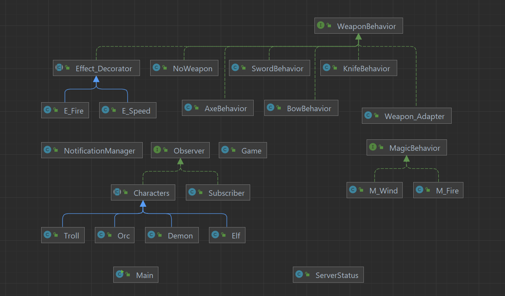

# Software Design Patterns | FINAL PROJECT
### _made by Sultan Abdukarimov and Ualikhan Kamarov | SE-2211_
_Link to github: https://github.com/Asu1a/SoftwareDesignPatterns.git_

## Main info

Our project is a template of online game. In our work we tried to implement 6 software design patterns.
Thanks to these patterns and methods we can add some details and in-game mechanics like __server status, enemies, notifications, status effects, physical/magic power__.
We have four starter races: __Elf, Orc, Demon and Troll__.
Also, we're using __Characters__ class as base for every player hero.

## Our project contains 6 design patterns: __adapter, decorator, observer, singleton, strategy and factory__.

## Adapter:

Consist of __MagicBehavior__ interface, __M_Fire, M_Wind__  classes and Adapter itself (__Weapon_Adapter__).

The main role of our implementation of adapter pattern is to switch from __WeaponBehavior__ to __MagicBehavior__ that allows player to cast some spells like Fire and Wind spells.
__M_Fire__ and __M_Wind__ are classes of magic spells.

## Decorator:

Consist of __E_Fire, E_Speed__ classes and Decorator itself (__Effecct_Decorator__).

Here we used decorator to stack status effect on player like fire and speed.
__E_Fire__ and __E_Speed__ are classe of status effects.

## Observer:

Consist of __Observer__ interface, __Game__, __Subscriber__ and __NotificationManager__ classes.

Observer pattern helps us to notify players about update of our games, but only if player subscribed to get notifications.

## Singleton:

Consist of only __ServerStatus__ class.

Singleton used to contain only one unique object (ServerStatus) about our game. __ServerStatus__ have attributes: __serverName, serverCondition, maxPlayers and playersOnline.__

## Strategy:

Consist of __WeaponBehavior__ interface and some weapon behaviors (classes).

In our game player can hold only one weapon (axe, bow and etc.) and using Strategy pattern here we'll great for us by __setting weapon behavior__.

## Factory:

Consist of __MobsFactory__ (main class), __Mobs__ interface for mobs,  __F_Snake__ and __F_Spider__ classes.

We have mobs such as __snake__ and __spider__ in our game and to spawn them we're using factory method.

## UML-Diagram

## _Thanks for reading_
